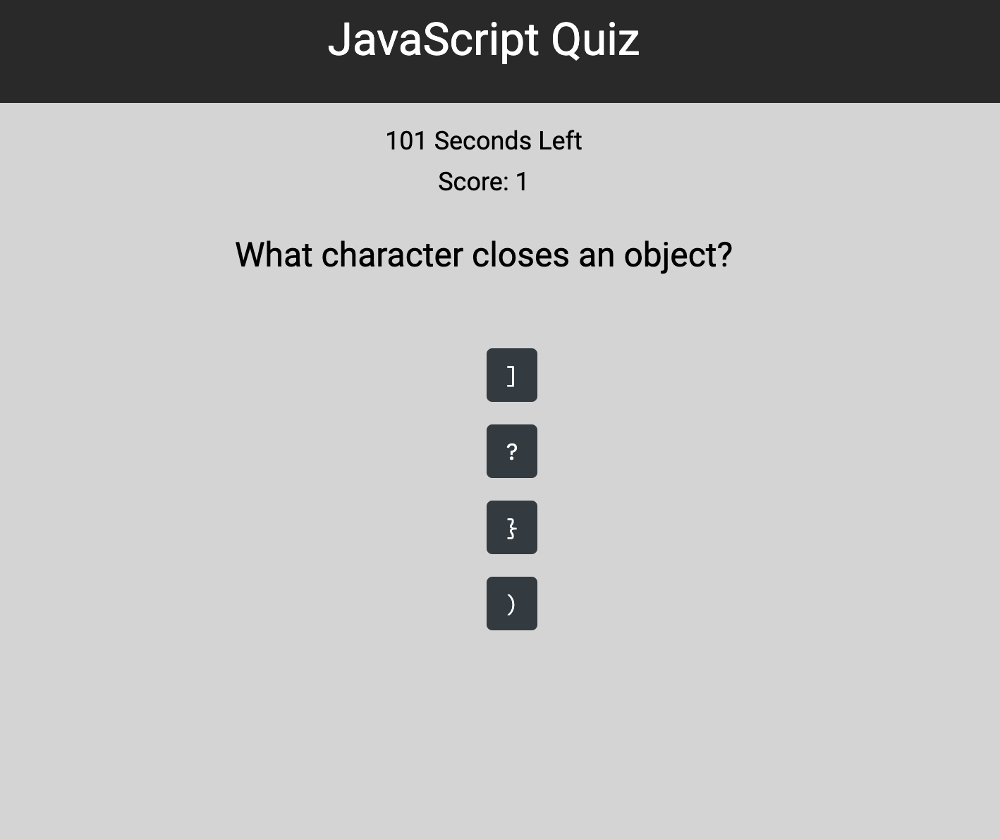

# Code Quiz

---

A timed quiz for coding boot camp students that focuses on JavaScript fundamenmtals. The quiz is timed and allows high scores to be stored.

---

## Requirements

GIVEN I am taking a code quiz \
WHEN I click the start button \
THEN a timer starts and I am presented with a question \
WHEN I answer a question \
THEN I am presented with another question \
WHEN I answer a question incorrectly \
THEN time is subtracted from the clock \
WHEN all questions are answered or the timer reaches 0 \
THEN the game is over \
WHEN the game is over \
THEN I can save my initials and score

---

## Links

* [Code Quiz](https://jondnv.github.io/CodeQuiz/)
* [Github Repository](https://github.com/JonDnv/CodeQuiz)

---

## Mock-Up

The following images shows the finished site: \

---

## Contributing

* Bootstrap
* Font Awesome
* Flexbox
* [Fonticon](https://gauger.io/fonticon/)
* [Stack Overflow](https://stackoverflow.com/questions/8378870/generating-unique-random-numbers-integers-between-0-and-x)

---

## Change History

1. Created Shell index.html, index.js, styles.css, & README.md files
2. Created Question & Answer Arrays
3. Completed HTML & CSS files
4. Started function declaration in index.js
5. Completed functions for quiz functionality
6. Completed Local Storage Set Up for High Scores